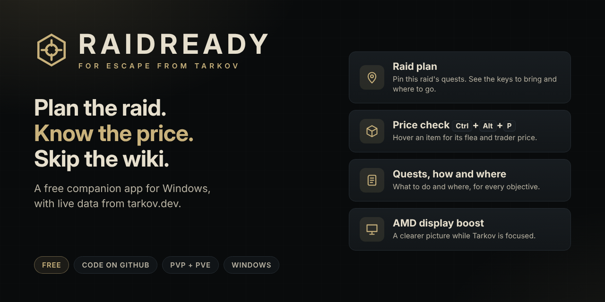

# RaidReady

**A free companion for Escape from Tarkov on Windows, with all its code on GitHub.** Pin the quests
you're doing this raid and see what to bring and where to go, check any item's price
with one hotkey, follow every quest without opening the wiki, and get a clearer picture
in dark areas on AMD cards.

**[Download RaidReady for Windows](https://github.com/Grat6969/EFT-amd-control/releases/latest/download/RaidReadySetup.exe)**: run
the installer and start RaidReady from the Start menu. Nothing else to install.



- **Raid plan**: a map can have 15 open quests when you only mean to do three. Pin those,
  pick the map, and RaidReady lists the keys and items to take, what to look for, and how
  and where to do each objective, with a tick box for each.
- **Price check in game**: hover over an item and press `Ctrl+Alt+P` for its flea price,
  best trader, price per slot, and whether your quests or hideout still need it.
- **Everything from [tarkov.dev](https://tarkov.dev)** in one window: live flea and
  trader prices, quests, hideout, barters, crafts, ammo, maps, bosses, traders,
  achievements, server status and goon sightings.
- **Your progress**: tick off quests and hideout levels and the app works out what's
  available next and every item you still need (and what it costs to buy). Optionally
  let it **follow Tarkov's own log files** to tick quests off as you finish them, and
  **import your progress from TarkovTracker**.
- **Automatic AMD display settings** while Tarkov is focused (saturation, brightness,
  contrast, gamma), with an optional boost in dark areas.
- **PvP and PvE**, and **one-click updates** from inside the app.

It never touches the game's memory or process and never changes the game's files. See
[Is it safe?](#is-it-safe)

RaidReady is a fan-made tool. It isn't made or endorsed by Battlestate Games or tarkov.dev.

## Install

1. Download **[RaidReadySetup.exe](https://github.com/Grat6969/EFT-amd-control/releases/latest/download/RaidReadySetup.exe)**
   and run it. It installs to your own user folder (no admin needed) and adds a Start menu
   shortcut.
2. If Windows says "Windows protected your PC", click **More info**, then **Run anyway**.
   The installer isn't signed by a company yet, but every line of RaidReady is in this
   repository, and it comes with its own copy of Python (the official one from python.org),
   so there's nothing else to install.
3. Start **RaidReady** from the Start menu. The app opens in its own window.

<details>
<summary>Prefer a portable copy (no installer)?</summary>

1. Download **[RaidReady-windows.zip](https://github.com/Grat6969/EFT-amd-control/releases/latest/download/RaidReady-windows.zip)**.
2. Right-click the zip, choose **Properties**, tick **Unblock** and press OK, then unzip it
   somewhere you can write to, such as Documents (not Program Files).
3. Double-click `run.bat` in the RaidReady folder.

It's the same app as the installer, just in a folder you can move or delete yourself.

</details>

<details>
<summary>Install with your own Python instead</summary>

1. Install Python 3.9 or newer from [python.org](https://www.python.org/downloads/)
   (ticking "Add python.exe to PATH" is a good idea; the scripts also find Python
   through the `py` launcher the installer adds).
2. Download this repository as a ZIP (**Code → Download ZIP**) and unzip it anywhere.
3. Double-click `install.bat` once (installs Windows' text recognition for the price check).
4. Double-click `run.bat`.

</details>

The window is a local page shown by Microsoft Edge (which comes with Windows) in
"app" mode, so it has no tabs or address bar. Closing it quits the app and puts
your display settings back to normal, unless you turn on **Settings → Keep running
after closing the window**. Running `run.bat` again while the app is open just
opens another window.

## Updating

- **In the app:** a gold "Update" button appears at the bottom of the sidebar when a
  new version is out. Click it (or go to **Settings → Updates**), then **Update &
  restart**: the app downloads the new version, installs it and restarts itself. This
  works whether you used the installer or the portable zip.
- **Without the app:** close it and either run the latest `RaidReadySetup.exe` over the
  top, or double-click `update.bat` in the app folder.

Updates replace the app's code only. Your settings, display profiles and progress are
stored in `%APPDATA%\TarkovDisplay` and are kept.

## What's in it

| Page | What you get |
|------|--------------|
| **Home** | Game server status, trader restock timers, where the Goons were last seen, wipe day, your progress, best value per slot |
| **Prices** | Every item with flea average, lowest listing, 48h change, best trader, price per slot, and whether your open quests or hideout need it. Click any item for details |
| **Item details** | All sell and buy offers (trader levels, limits, quest locks), 7-day price chart, flea fee calculator, where it's needed, barters and crafts that make or use it |
| **Barters** | Every trader barter with cost, value and profit at today's prices |
| **Crafts** | Hideout crafts ranked by profit per hour; filter to stations you've built |
| **Ammo** | Damage vs penetration chart per caliber, full stats, a rough armor-class guide, prices |
| **Quests** | All quests with objectives, rewards and prerequisites, and how and where to do each objective. Filter by available / locked / done / pinned, trader, map, Kappa or Lightkeeper. Pin quests for your next raid. Marking a quest done also marks every quest before it (with Undo) |
| **Raid plan** | The quests you pinned, for the map you're going to: keys and items to take, what to look for, each objective's how and where with a tick box or counter, and other quests you could do on that map |
| **Hideout** | Set each station's level; see what the next upgrade (or all of them) needs and the cost to finish |
| **Needed items** | Everything your unfinished quests and hideout still need, found-in-raid counts, a "have" counter for each item, and the cost to buy the rest |
| **Achievements** | All achievements with rarity and how many players have them; tick off yours |
| **Maps** | Zoomable 2D/3D map images, bosses with spawn chances, extracts by faction, every locked door with its key's price and whether a quest needs it, transits and hazards |
| **Bosses** | Health per body part, where and how often they spawn, escorts, likely gear |
| **Traders** | Restock countdowns, loyalty level requirements, everything each trader sells |
| **Display** | Display profiles, auto-boost and price-check settings |
| **Settings** | PvP / PvE, your level and faction, flea fee settings, game log reader, TarkovTracker, data refresh, updates, backup and restore |

Progress is saved on your PC, separately for PvP and PvE. **Settings → Backup** exports
it to a file.

## Raid plan

A map can have 15 open quests when you only mean to do three of them this raid.

1. On **Quests**, press the pin button on the quests you're going for (the **Pinned**
   filter shows them).
2. Open **Raid plan** and pick the map you're going to. It shows only the pinned quests
   with something to do on that map (or on any map), and:
   - **Take with you**: keys, markers, items to place or use, and the weapon or gear an
     objective asks for.
   - **Look for in raid**: quest items and found-in-raid items.
   - Each objective spelled out: what to kill, find, place or mark; the map and area; the
     key it needs; time of day, range, weapon, gear you must or mustn't wear; how you must
     extract. **Show the spot on tarkov.dev's map** opens tarkov.dev's interactive map
     with the place highlighted.
   - Other quests you could do on the same map, with a **Pin** button.
3. Tick objectives off as you go (kills and similar have a counter). **Done** finishes the
   quest (with Undo); finished quests drop off the plan by themselves.

The same how-and-where details are on every quest on the **Quests** page. With the game log
reader on, loading into a raid opens the raid plan for that map.

## Automatic progress (optional)

Both are in **Settings** and are off until you set them up.

### Game log reader

Tarkov writes plain-text log files to the `Logs` folder in its install folder. With
**Read Tarkov's log files** on, the app follows the current session's logs and:

- marks a quest done the moment you finish it (and every quest before it),
- opens your raid plan when you load into a map with pinned quests, otherwise that map's
  page (you can turn that off),
- shows flea market sales,
- warns you if Tarkov is in PvE but the app is showing PvP (or the other way round).

The logs folder is found automatically for launcher and Steam installs; if it isn't, paste
the path (for example `C:\Battlestate Games\Escape from Tarkov\Logs`).

**Scan old logs** reads the sessions Tarkov still has on disk and offers to mark the
quests you finished in them as done, together with every quest before them. That can fill
in a lot of your history in one go.

The app only opens these log files to read them. It never reads or changes the game's
memory, process or any other file.

### TarkovTracker

If you track progress on [tarkovtracker.org](https://tarkovtracker.org) or
[tarkovtracker.io](https://tarkovtracker.io), create an API token in your account
settings there (allow it to read progress; also to write progress if you want quests sent
back), pick the site in **Settings → TarkovTracker**, paste the token into the PvP or PvE
box and click **Import now**. tarkovtracker.org tokens start with `PVP_` or `PVE_`.

Importing adds finished quests, built hideout levels, your level and faction. It never
removes anything you've ticked off in the app. You can also have it import every time
the app starts, and send quests the game log reader sees you finish back to TarkovTracker.

Tokens are stored encrypted for your Windows account (Windows DPAPI) and are only ever
sent to the TarkovTracker site you chose.

## Price check in game: Ctrl+Alt+P

Hover over an item in your stash or a container until Tarkov shows its name, then
press `Ctrl+Alt+P`. A small popup next to the mouse shows the flea price, best trader,
price per slot, where to sell it, and which of **your unfinished** quests or hideout
upgrades still need it. The popup never takes focus from the game.

It takes one screenshot around the mouse only when you press the hotkey, reads the
name with Windows' built-in text recognition and looks it up in the price list. Run
Tarkov in **Borderless** window mode; exclusive fullscreen hides the popup and gives
black screenshots.

If nothing shows up when you press it:

- Check **Display → Price check**: it says whether a text reader is installed (if not,
  run `install.bat` and restart the app) and whether another program already uses
  `Ctrl+Alt+P` (overlays such as Discord, Steam, AMD or NVIDIA often do; change it there).
- Use **Borderless** window mode in Tarkov.
- Wait until the item's name tooltip is showing before pressing the keys.

If it misreads items, turn on **Display → Price check → Save each capture** (captures
go to `%APPDATA%\TarkovDisplay\scans`) or run `python -m tarkov_display scan --debug`.
The capture area can be adjusted in `config.json` under `"scan"`.

## Display settings

While the Tarkov window is focused, the app applies a display profile through your
AMD driver (the same Display Color settings as AMD Software: Adrenalin Edition) and
the Windows gamma ramp, and puts your normal settings back when you alt-tab or quit.

| Profile | Brightness | Contrast | Saturation | Gamma | For |
|---------|-----------:|---------:|-----------:|------:|-----|
| balanced | 10 | 110 | 135 | 1.15 | most maps |
| day | 5 | 112 | 140 | 1.05 | bright daytime maps |
| interiors | 15 | 115 | 135 | 1.30 | Labs, Interchange, Reserve bunkers, Factory |
| night | 25 | 105 | 125 | 1.50 | night raids |

Adjust them on the **Display** page; **Preview on the desktop now** shows changes
without the game running.

**Auto-boost in dark areas** (off by default) reads 5 small patches of the game window
4 times a second and eases in extra gamma and brightness when the scene is dark. Use
**Borderless** window mode in Tarkov; in exclusive fullscreen Windows returns black
screenshots. Note: like any screen-reading tool, use it at your own risk with BattlEye.

Windows limits how far gamma can move. If high gamma values are refused, double-click
`enable_full_gamma_range.reg` once and reboot. If the screen ever looks wrong:
AMD Software → Display → Display Color → Reset.

On NVIDIA or Intel GPUs the display part falls back to gamma only (brightness and
contrast emulated, no saturation). Everything else works on any PC.

## Hotkeys (while Tarkov is focused)

| Keys | Action |
|------|--------|
| `Ctrl+Alt+1` … `9` | Switch display profile |
| `Ctrl+Alt+0` | Turn display changes off / on |
| `Ctrl+Alt+A` | Turn auto-boost off / on |
| `Ctrl+Alt+P` | Price-check the item under the mouse |

If another program already uses one of these, Windows gives it to that program; the
**Display** page lists any that are taken.

## Where the data comes from

- **[tarkov.dev](https://tarkov.dev)**: a free, open-source community project built from
  the game's own data, live flea market scans, and the official
  [server status page](https://status.escapefromtarkov.com/). The app reads the same
  data files tarkov.dev's website loads (`json.tarkov.dev`), and only falls back to
  their GraphQL API, which is often overloaded ("GraphQL server unavailable"). Prices
  refresh every 15 minutes; quests, hideout and the rest every few hours. Everything is
  cached, so the app still works offline with the last data it downloaded.
- **tarkov.dev's website data on GitHub**: which map images exist (and who made them)
  and wipe dates.
- **Map images** are made by the community artists credited on each map.
- The flea fee formula is from tarkov.dev (MIT licence), which follows the game wiki.

Other price sites (such as tarkov-market) need a paid API key, and scraping websites
breaks whenever they change, so they aren't used.

If a page says "Couldn't load this from tarkov.dev", their server is busy; the app keeps
the last data it had and retries on its own. **Settings → Data from tarkov.dev** shows
when each part was last updated, the error if one failed, and refresh buttons.

## Is it safe?

What RaidReady does, and doesn't do:

- It never reads or changes the game's memory, never injects anything into the game, and
  never changes the game's files.
- **Price check**: takes one screenshot around the mouse when you press `Ctrl+Alt+P` and
  reads the item name with Windows' built-in text recognition, the way tools like
  RatScanner do.
- **Auto-boost** (off by default): looks at 5 small patches of the screen a few times a
  second to tell when the scene is dark.
- **Game log reader** (off by default): reads the text log files Tarkov writes, read-only.
- **Display settings**: go through your AMD driver and the Windows gamma ramp, the same
  settings AMD Software changes.
- The app's window is served from your own PC (127.0.0.1) and only that window can use
  it: every request needs a random key created at start-up.
- It only talks to tarkov.dev, GitHub (for updates and map/wipe data), the image hosts
  used by tarkov.dev, and TarkovTracker if you add a token. No accounts, no ads, no
  tracking.

Nobody but Battlestate Games can promise that a third-party tool won't get you banned, and
their rules can change. Use it at your own risk. The code is on GitHub, so you or anyone else
can check every line.

## Command line

With the zip download, use `python\python.exe` in place of `python`.

```
python -m tarkov_display              # open the app (same as run.bat)
python -m tarkov_display watch        # display control + hotkeys only, in a console
python -m tarkov_display price ledx   # look up prices by name
python -m tarkov_display scan --debug # price-check under the mouse every 3 s (testing)
python -m tarkov_display scene        # live auto-boost readings
python -m tarkov_display displays     # show detected AMD displays
python -m tarkov_display apply night  # apply a profile now and leave it on
python -m tarkov_display restore      # undo 'apply'
```

## Standalone .exe

`build_exe.bat` builds `dist\RaidReady.exe`. The .exe can't update itself; rebuild
it after updating the code.

## Development

```
pip install pytest
python -m pytest
python -m tests.demo        # run the app with made-up data on http://127.0.0.1:47999/
```

The tests use fake tarkov.dev responses, so they run on any OS without internet. Set
`TARKOV_SCHEMA` to tarkov-api's `schema-static.mjs` to also check every query against
tarkov.dev's schema.

Raising `__version__` in `tarkov_display/__init__.py` on the default branch makes GitHub
build both downloads (the app plus its own Python) and publish them as a release:
`RaidReadySetup.exe` (the installer, from `installer/raidready.iss`) and
`RaidReady-windows.zip` (the portable copy). See `.github/workflows/release.yml`.
